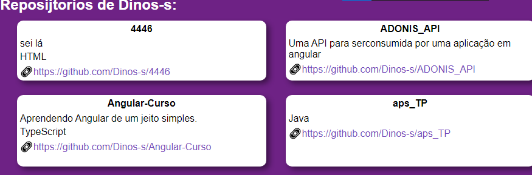
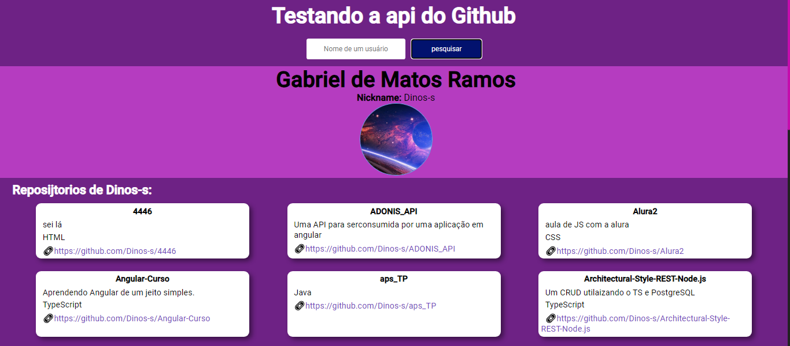
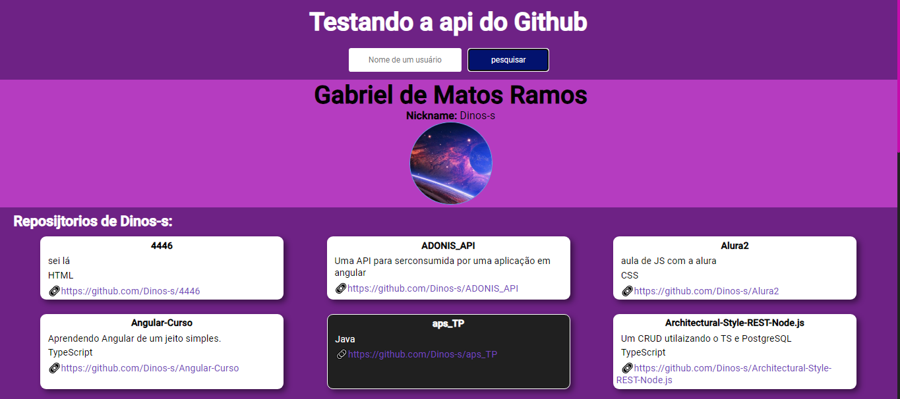

# Vue 3 + Axios
Criando um Github finder, usando axios!

## 2/7/2023 - primeira tentativa
Sucesso: com apenas um componente;  
Próxima: dividir componentes;

## 6/7/2023 - ropositórios
Sucesso: obitive sucesso em criar um componente para os repositórios;  
Próximo: tentar chamar os repositorios de forma automatica;

## 8/7/2023 - talvez versão final
Sucesso: em fim, posso dizer que o projeto chego no seu final;  
Próximo: estilizar os projeto, da vida e cores;

# Vídeo do protótipo do projeto 

## 9/7/2023 - dando estilo
Hoje dei inicio a customização e estilização do projeto;

### Foto da nova versão

## 10/7/2023 - tentativa de estilizar
Estou sem ideia de estilização;
Apenas realizei a adição dos estilos na app.js;

## 12/07/23 - melhorando estilização
Criei um pequena animção no hover para o perfil no github;

## 13/7/203 - estilizando os lis
Coloquei os items de cada repositório em um tipo de card junto com:
- nome do repositório;
- sua descrição;
- linguagem utilizada;
- link para repositório no GitHub;

## 17/7/2023 - talvez finalizado
Enfim parece que conseguir finalizar esse projetionho incrvel eu realmente adorei😎👍

